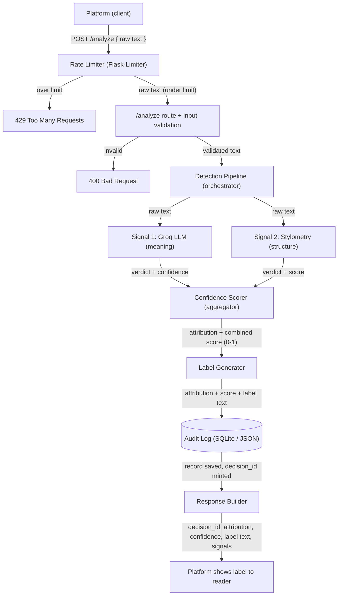
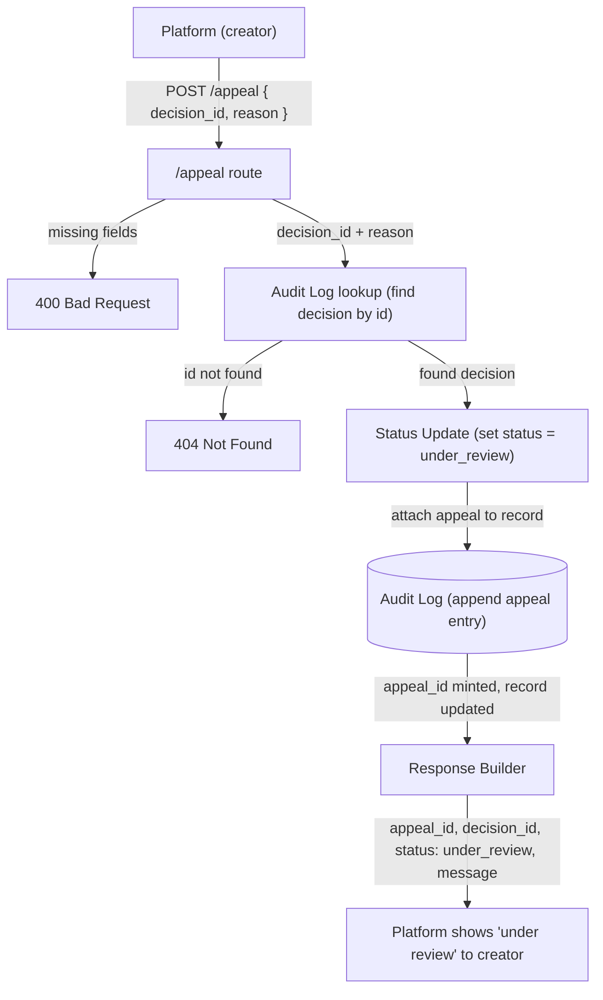

# Provenance Guard — Planning

Design notes and architecture for the system. This is a working document.

---

## Architecture

### The path one piece of text takes (submission → label)

A writer posts a poem. Here is what happens before they see a label.

**1. The platform sends the text.** The writing site sends the poem to Provenance Guard
as a `POST /analyze` request. The text is in the request.

**2. The rate limiter checks first.** Before anything else, Flask-Limiter checks how many
times this user has submitted recently. If they have sent too many, it stops them with a
"too many requests" error. This happens before any real work, so no one can flood the
system. If they are under the limit, the request moves on.

**3. The endpoint checks the input.** The `/analyze` route receives the text and makes
sure it is valid: it is real text, it is a string, and it is not empty or too long. If the
input is bad, it stops here with a clear error. This saves a wasted model call.

**4. The detection pipeline runs both signals.** This part gathers evidence. It sends the
text through two checks and collects both results. It does not pick the winner yet.

- **4a. Signal 1 — Groq model (meaning).** It sends the poem to the Groq model and asks:
  does this read as human or AI? The model gives an answer and its reasoning. This judges
  the overall feel of the writing.
- **4b. Signal 2 — Stylometry (structure).** A small Python function measures the text:
  how much sentence length varies, how varied the word choice is, how much punctuation is
  used, how complex the sentences are. AI text tends to be even and uniform. Human text
  tends to vary more. No model is used here. The math is the same every time.

**5. The confidence scorer combines them.** It takes both results and turns them into one
answer plus a score from 0 to 1. Two rules matter here. First, it is careful about calling
human work AI, because that mistake is worse. Second, when the two signals disagree, it
lowers the score on purpose. That is how we get an honest "not sure" instead of a forced
guess.

**6. The label generator picks the wording.** It looks at the answer and the score and
picks one of three plain-language labels: likely AI, likely human, or unsure. This is the
text a reader actually sees.

**7. The audit log saves the record.** Before sending the reply, the system saves a
record: the time, the text, what each signal said, the final answer, the score, and the
label shown. It is stored in SQLite or JSON. This is the permanent record, and it is what
an appeal attaches to later.

**8. The response goes back.** The system builds the reply: the answer, the score, the
label text, and an ID for this decision. The ID lets the writer point to this exact
decision if they appeal.

**9. The platform shows the label.** The reader sees it. Done.

#### Two places things connect (the seams)

- The **decision ID** from steps 7–8 is the thread that ties it all together. It is how an
  appeal finds the original decision later.
- The **audit log** is used by two paths: `/analyze` writes the first record, and
  `/appeal` adds to it. Planning for both now keeps the appeal feature from breaking later.

### Diagram

The endpoint is `POST /analyze` (the project notes sometimes call it `/submit`). Arrows are
labeled with what passes between components.

#### Flow 1 — Submission (`POST /analyze`)

```
   Platform (client)
     │  POST /analyze   { raw text }
     ▼
   Rate Limiter (Flask-Limiter) ──[over limit]──▶ 429 Too Many Requests ──▶ Platform
     │  raw text (under limit)
     ▼
   /analyze route + input validation ──[invalid]──▶ 400 Bad Request ──▶ Platform
     │  validated text
     ▼
   Detection Pipeline (orchestrator)
     │
     ├──[raw text]──▶ Signal 1: Groq LLM (meaning) ──────[verdict + confidence]──┐
     │                                                                            │
     ├──[raw text]──▶ Signal 2: Stylometry (structure) ─[verdict + score]────────┤
     │                                                                            │
     │◀──────────────────────── both signal results ─────────────────────────────┘
     │  both signal scores
     ▼
   Confidence Scorer (aggregator)
     │  attribution + combined score (0–1)
     ▼
   Label Generator
     │  attribution + score + label text
     ▼
   Audit Log  (SQLite / JSON)
     │  full record saved, decision_id minted
     ▼
   Response Builder
     │  { decision_id, attribution, confidence, label text, signals }
     ▼
   Platform  ──▶ shows the label to the reader
```

#### Flow 2 — Appeal (`POST /appeal`)

```
   Platform (creator)
     │  POST /appeal   { decision_id, reason }
     ▼
   /appeal route ──[missing fields]──▶ 400 Bad Request ──▶ Platform
     │  decision_id + reason
     ▼
   Audit Log lookup ──[id not found]──▶ 404 Not Found ──▶ Platform
     │  find original decision by decision_id
     ▼
   Status Update
     │  set status = "under_review"; attach appeal to the decision record
     ▼
   Audit Log  (append appeal entry next to the original decision)
     │  appeal_id minted, record updated
     ▼
   Response Builder
     │  { appeal_id, decision_id, status: "under_review", message }
     ▼
   Platform  ──▶ shows "under review" to the creator
```

**The shared seam:** both flows touch the **Audit Log**, and both rely on the
**decision_id**. The submission flow mints it and saves the first record; the appeal flow
uses it to find that record and add to it. Same ID, same entry, everything in one place.

#### Mermaid versions (render on GitHub)

Same two flows as above, drawn in Mermaid so they render as real diagrams on GitHub.

**Flow 1 — Submission (`POST /analyze`)**



**Flow 2 — Appeal (`POST /appeal`)**



---

## Detection Signals

The system uses two signals. One looks at meaning, the other looks at structure. They are
different on purpose, so their blind spots barely overlap.

### Signal 1 — Groq model (meaning / semantic)

**What it measures.** Whether the writing reads as human or AI when you look at it as a
whole — the overall feel. Meaning, tone, flow, and how the ideas connect. We send the text
to the Groq model and ask it to judge.

**Why this differs between human and AI.** AI writing often comes out smooth, even, and
"safe." It hits the expected points, stays balanced, and rarely takes odd risks. Human
writing usually has a personal voice — surprising word choices, small quirks, real lived
detail, and sometimes mess. The model has read huge amounts of both, so it can pick up on
that overall feel in a way a fixed rule cannot.

**What it can't capture (blind spot).**
- It is a guess. The model has no real answer key, so it can be confidently wrong.
- **Polished, edited human writing can read as "AI-smooth" and get flagged as AI.** This is
  the dangerous mistake — a false positive on a real person's work.
- AI text that a human lightly edited, or that was prompted to sound quirky, can slip past it.
- It is not perfectly consistent. The same text can get a slightly different answer on
  different runs.
- Short text gives it very little to judge, so it is weaker on a short poem than a long essay.
- Unusual styles — non-native English, experimental writing — can read as "off" and get
  misjudged.

### Signal 2 — Stylometry (structure)

**What it measures.** Countable patterns in the text: how much sentence length varies, how
varied the word choice is (type-token ratio), how much punctuation is used, and how complex
the sentences are. Pure math, no model.

**Why this differs between human and AI.** AI tends to produce even, uniform output —
similar sentence lengths, a steady rhythm, middle-of-the-road vocabulary. Humans vary more:
a short sentence next to a long one, bursts of unusual words, uneven punctuation. So lots of
variation tends to look human, and flat uniformity tends to look AI.

**What it can't capture (blind spot).**
- It only sees structure, never meaning. Varied nonsense would still look "human" to it.
- It needs enough text. On a short poem or a haiku the numbers are unstable and unreliable.
- It is easy to game once you know the rules. A person — or a prompt — can add variety on
  purpose.
- Genre throws it off. Poetry, lists, and technical writing all have unusual stats that have
  nothing to do with human vs. AI.
- The cutoffs are fuzzy. There is no clean line where "uniform" turns into "AI."
- Heavily edited AI text can pick up human-like variation and pass.

### Why this pair works together

One signal looks at **meaning**, the other looks at **structure**. Their blind spots barely
overlap, so they cover for each other:

- The model can be fooled by smooth, polished human writing — but the stats may show that
  writing is actually quite varied, which pulls back toward "human."
- The stats can be gamed by adding variety on purpose — but the model may still feel the
  text reads as AI.

When the two **disagree**, that is not a failure. That disagreement is real evidence of
uncertainty, and it is exactly what should push a submission toward the "unsure" label
instead of a forced guess. This is also where the false-positive rule lives: if either
signal is shaky, we lean away from calling a human's work AI.

---

## Design for the Worst Case (False Positives)

**The scenario.** A real person writes a poem themselves. They post it. Our system labels
it "likely AI." Maybe their writing is clean and polished, so the model reads it as
"AI-smooth." Maybe the poem happens to have even sentence lengths, so the stats lean AI
too. The text is short, so neither signal has much to go on — but both tip the same wrong
way.

**Why this is the worst mistake.** This is not a small error. We just told a real creator,
in public, that they passed off AI work as their own. That hurts their reputation and their
attribution — the exact thing we are supposed to protect. A person treated this way may
never trust the platform again. So the whole system is built to make this mistake rarely,
to soften it when we are unsure, and to give an easy way to fix it.

### 1. How the confidence score reflects the uncertainty

The score is built to be careful here, on purpose:

- **A confident "AI" call requires strong, agreeing evidence.** If both signals are not
  clearly pointing to AI, we do not give a high AI score.
- **Disagreement lowers the score.** If the model says AI but the stats say human (or the
  reverse), the score drops into the "unsure" middle instead of staying high.
- **Short or thin text caps how confident we allow ourselves to be.** Less evidence means
  less confidence, not more.

So in a good design, this misclassified human poem should land in the **unsure** band, not
in "high-confidence AI." That cautious scoring is the first line of defense. The asymmetry
is the rule: when in doubt, we lean away from calling a human's work AI.

### 2. What the label says

- **If it lands in "unsure"** (the goal): the label does **not** accuse. It says something
  like "We could not tell whether AI helped with this. Treat this as a flag for context,
  not a final answer," and it points to the appeal path. No one is branded.
- **If it wrongly lands in "high-confidence AI"** (the bad case): even then, the label never
  states it as fact. It says our *system* thinks this is *likely* AI — an automated guess —
  and it **always** shows the creator can contest it. The label is about the text, never a
  judgment of the person.

The label wording itself is a safety feature. It keeps the worst case from feeling like a
final verdict.

### 3. How the creator appeals

- The creator sees the label and the **decision ID** that came back with it.
- They send `POST /appeal` with that ID and their reasoning ("I wrote this myself — here are
  my drafts / my process").
- The system finds the original decision by ID, saves their reasoning, writes an **appeal
  entry in the audit log right next to the original decision**, and flips the content's
  status to **"under review."**
- While it is under review, the AI label should step back — the platform can show "under
  review" instead, so the creator is not publicly branded while the dispute is open.
- A human can then look at it. (Automatic re-checking is not required — the path just has to
  exist.)

### What this means for Milestone 2

This scenario gives us concrete rules to build with:

- **Set a high bar for a confident "AI" label, and make the "unsure" band wide.** Borderline
  cases should fall into "unsure," not "AI."
- **Make signal disagreement lower the score.** Build that in, do not treat it as noise.
- **Cap confidence on short text.**
- **Word every label as an automated guess, never a fact, and always show the appeal path.**
- **Give content a status field** that can become "under review."
- **Tie the appeal to the original decision with a decision ID,** and keep both in the audit
  log together.

---

## API Surface

Three endpoints cover all seven required features. This is the contract the rest of the
code will follow.

| Method | Path       | Purpose                                  |
|--------|------------|------------------------------------------|
| POST   | `/analyze` | Submit text, get an attribution + label  |
| POST   | `/appeal`  | Contest a classification                 |
| GET    | `/log`     | View the audit log                       |
| GET    | `/health`  | Service health check (for monitoring)    |

### `POST /analyze`

Submit one piece of text. Get back the result, the confidence score, and the label.

**Accepts** (JSON body):
```json
{
  "text": "The poem or story text goes here.",
  "creator_id": "optional - who submitted it"
}
```
- `text` — **required.** The content to check.
- `creator_id` — optional. Helps tie decisions to a creator in the log.

**Returns** (`200 OK`):
```json
{
  "decision_id": "a1b2c3",
  "attribution": "uncertain",
  "confidence": 0.58,
  "label": {
    "variant": "uncertain",
    "text": "We could not tell whether AI helped with this..."
  },
  "signals": {
    "llm": { "verdict": "ai", "confidence": 0.7 },
    "stylometry": { "verdict": "human", "score": 0.4 }
  },
  "status": "classified",
  "timestamp": "2026-06-28T18:00:00Z"
}
```
- `decision_id` — the ID the creator uses to appeal later.
- `attribution` — one of `likely_ai`, `likely_human`, `uncertain`.
- `confidence` — number from 0 to 1.
- `label` — the exact text shown to a reader (plus which variant it is).
- `signals` — what each signal said. Included so the result is transparent.
- `status` — `classified` now; can become `under_review` after an appeal.

**Errors:**
- `400` — text missing, empty, or too long.
- `429` — rate limit hit.

### `POST /appeal`

A creator contests a decision.

**Accepts** (JSON body):
```json
{
  "decision_id": "a1b2c3",
  "reason": "I wrote this myself. Here is my draft history."
}
```
- `decision_id` — **required.** Which decision they are contesting.
- `reason` — **required.** Their reasoning.

**Returns** (`200 OK`):
```json
{
  "appeal_id": "x9y8z7",
  "decision_id": "a1b2c3",
  "status": "under_review",
  "message": "Your appeal was received. This content is now under review.",
  "timestamp": "2026-06-28T18:05:00Z"
}
```
- Saves the reason, writes an appeal entry next to the original decision in the log, and
  flips status to `under_review`.

**Errors:**
- `400` — `decision_id` or `reason` missing.
- `404` — no decision found with that ID.

### `GET /log`

View the audit log. This is how graders see the structured record.

**Accepts:** optional query param `?limit=N` (default: return all, newest first).

**Returns** (`200 OK`): a list of entries.
```json
[
  {
    "decision_id": "a1b2c3",
    "timestamp": "2026-06-28T18:00:00Z",
    "text_snippet": "The poem or story text...",
    "signals": { "llm": {}, "stylometry": {} },
    "attribution": "uncertain",
    "confidence": 0.58,
    "label_variant": "uncertain",
    "status": "under_review",
    "appeals": [
      {
        "appeal_id": "x9y8z7",
        "reason": "I wrote this myself...",
        "timestamp": "2026-06-28T18:05:00Z"
      }
    ]
  }
]
```

### `GET /health`

A simple health check for monitoring and uptime tools. Lets us know the service is up and
its key parts are ready, without submitting real content.

**Accepts:** nothing.

**Returns** (`200 OK` when healthy):
```json
{
  "status": "ok",
  "timestamp": "2026-06-28T18:00:00Z",
  "checks": {
    "audit_log": "ok",
    "groq_api_key": "present"
  }
}
```
- `audit_log` — can we reach and write to the log store (SQLite/JSON)?
- `groq_api_key` — is the key configured? We only check that it is **present**, not that
  Groq itself is up. We do **not** call the Groq API on every health check — that would
  waste our free quota and add latency to a check that should be cheap and fast.

**Returns** (`503 Service Unavailable`): if a critical part is down — for example, the audit
log store cannot be written to. A monitoring tool can watch this endpoint and alert us.

### Two design choices baked into the contract

1. `/analyze` **echoes the signals back** in the response, not just the final answer. That
   keeps the system honest and transparent.
2. An appeal **lives inside the decision's log entry** (an `appeals` list), not in a
   separate place. One decision ID, one record, everything attached to it. That is what
   keeps the appeal feature from breaking at the seam.
